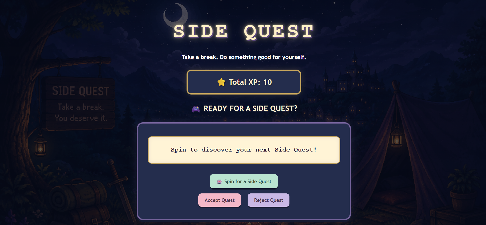
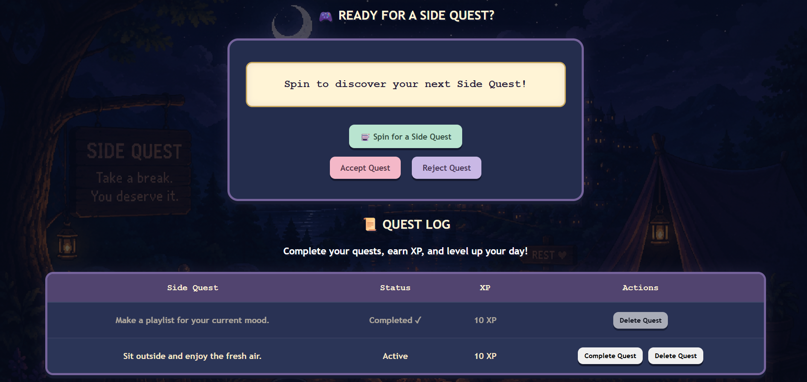

# 🎮 Side Quest 

A small web application that turns taking a break into a mini adventure.

Side Quest generates fun and healthy activities that encourage users to take short breaks from studying, working or spending too much time on a screen. Users can accept or reject quests, keep accepted quests in a Quest Log, complete them and earn XP.

The application was designed with a cosy, dark, video-game-inspired theme to make taking a break feel more enjoyable.

---

## ✨ Features

* Generate a random Side Quest.
* Accept or reject a generated quest.
* Prevent the same Side Quest from appearing twice in a row.
* Store accepted Side Quests in a Quest Log.
* Complete active Side Quests.
* Earn XP for completed quests.
* Display the user's total XP.
* Delete Side Quests from the Quest Log.
* Clearly show completed quests with a **Completed ✓** status.
* Automatically refresh the XP display when necessary.
* Handle network and server errors with user-friendly messages.
* Responsive layout for smaller screens.

---

## 📸 What Does It Look Like?

The finished Side Quest application includes a Side Quest generator and a Quest Log where users can manage their accepted quests.

### Side Quest Generator



### Quest Log



---

## 💻 What Do I Need to Run It?

Side Quest is designed to run locally on your computer. This means the application does not need to be hosted on a website for you to use it.

Before running Side Quest, make sure you have:

* Visual Studio Code installed.
* Node.js installed on your computer.
* A modern web browser such as Google Chrome, Microsoft Edge or Firefox.
* The Side Quest project files downloaded or cloned to your computer.

Visual Studio Code can be used to open the project files and run the required commands through its built-in terminal.

Once the project is set up and the server is running, the application can be accessed through your web browser using:

`http://localhost:3000`

---

## 🛠️ Technologies Used

### HTML

HTML creates the structure of the webpage, including the Side Quest generator, buttons, XP display and Quest Log.

### CSS

CSS controls the appearance of the application, including the colours, layout, background, buttons and video-game-inspired design.

### JavaScript

JavaScript makes the application interactive. It handles generating, accepting, rejecting, completing and deleting Side Quests, as well as updating the XP display.

### Node.js

Node.js runs the server-side JavaScript used by the application.

### Express.js

Express.js is used to create the backend server and API routes that allow the frontend to communicate with the backend.

### SQLite

SQLite stores information about accepted Side Quests, including their ID, activity, status and XP.

### Git and GitHub

Git was used to keep track of changes during development, while GitHub was used to store the project and its commit history.

---

## 🔄 How Does Side Quest Work?

Side Quest has three main parts that work together.

### Frontend

The frontend is what the user sees and interacts with.

It contains the Side Quest generator, buttons, XP display and Quest Log.

The frontend is built using HTML, CSS and JavaScript.

### Backend

The backend works behind the scenes.

When a user accepts, completes or deletes a Side Quest, the frontend sends a request to the backend.

The backend processes the request and communicates with the database.

Node.js and Express.js are used for the backend.

### Database

The database stores the Side Quest information.

SQLite allows accepted quests to remain stored so that they can be retrieved and displayed in the Quest Log.

In simple terms:

**User → Frontend → Backend → Database**

The information then travels back through the backend to the frontend so the user can see the updated application.

---

## 🚀 Installation

### 1. Open the Project

Open the Side Quest project folder in Visual Studio Code.

### 2. Open the Terminal

Open the terminal in Visual Studio Code and make sure you are inside the Side Quest project folder.

### 3. Install the Required Packages

Run:

```bash
npm install
```

This installs the packages required by the application.

---

## ▶️ Usage

### 1. Start the Server

Run:

```bash
node index.js
```

This starts the local server.

### 2. Open the Application

Open a web browser and go to:

```text
http://localhost:3000
```

### 3. Start a Side Quest

Select **Spin** to generate a random Side Quest.

The user can then:

* **Accept** the quest to add it to the Quest Log.
* **Reject** the quest and spin again.
* Complete accepted quests when they have finished the activity.
* Delete quests from the Quest Log when they are no longer needed.

Completed quests earn XP and are marked **Completed ✓** in the Quest Log.

---

## 🧪 Testing and Improvements

The application was tested throughout development to identify problems and improve the user experience.

Several issues were discovered and fixed.

### Repeated Side Quests

During testing, the same Side Quest could sometimes appear twice in a row after a user rejected a quest.

The JavaScript was updated to check the previously generated quest and select another quest if the same one was chosen again.

### Delete Button

The Delete button initially did not remove the selected quest from the database.

The backend was updated with the required SQL DELETE operation so that the selected Side Quest could be removed correctly.

### XP Refresh

After deleting a completed quest, the quest was removed but the displayed XP did not immediately update.

The JavaScript was updated so that the XP display refreshes after the deletion.

### Quest Log Improvements

The appearance of completed quests was improved to make them easier to distinguish from active quests.

The Quest Log was also changed so that completed quests no longer show a redundant Completed action. Instead, the status displays **Completed ✓**, while only the Delete Quest button remains available.

### Error Handling

Error handling was added to deal with situations such as the server being unavailable or a request failing.

The application checks whether requests are successful and uses `try...catch` blocks to handle unexpected errors. The user receives an appropriate message instead of the application failing without feedback.

---

## 📁 Project Structure

The main project files are:

```text
Side Quest/
│
├── public/
│   ├── index.html
│   ├── script.js
│   ├── style.css
│   └── side-quest-bg.png
│
├── index.js
├── package.json
├── LICENSE
└── README.md
```

### Important Files

* **`public/index.html`** – Creates the structure of the webpage.
* **`public/script.js`** – Contains the JavaScript that makes the application interactive.
* **`public/style.css`** – Contains the visual design and styling.
* **`public/side-quest-bg.png`** – The background image used by the application.
* **`index.js`** – Contains the Node.js and Express backend server and API routes.
* **`package.json`** – Contains the project information and required packages.
* **`LICENSE`** – Contains the MIT License.
* **`README.md`** – Contains information about the project and how to run it.

---

## 📄 License

Side Quest is licensed under the **MIT License**.

See the [LICENSE](LICENSE) file for the full licence terms.

---

## 🎯 Project Goal

The goal of Side Quest is simple:

**Take a break. Choose a quest. Complete your adventure.** 🎮

The project was created to practise building a complete web application while creating something that encourages users to take small, positive breaks during their day.